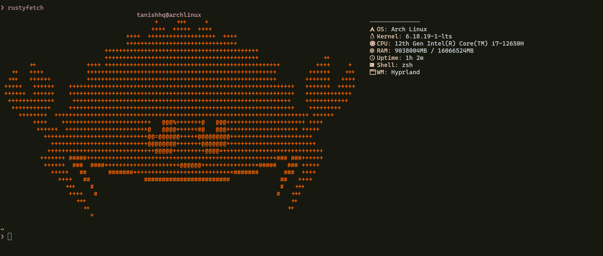

# 🦀 RustyFetch

> A minimal, aesthetic, and fast system fetch tool written in Rust.

---

## 💭 Why I built this

I recently started my journey with Rust 🦀, and this is one of my first *showable* (or flex-worthy 😄) projects.

Because I love ricing my Arch Linux + Hyprland setup, and let’s be honest — one of the first things people show when flexing their setup is a fetch screen.

So I thought… why not build my own?

RustyFetch is my take on that — simple, aesthetic, and built while learning Rust.

---


## 🚀 Installation

```bash
cargo install rustyfetch-cli
```

---

## ▶️ Usage

```bash
rustyfetch
```

---

## 📸 Preview



---

## ✨ Features

* 🦀 Custom crab ASCII logo
* ⚡ Fast and lightweight
* 🎨 Clean and colored output
* 🖥️ System information:

  * OS
  * Kernel
  * CPU
  * RAM
  * Uptime
* 🐚 Shell detection
* 🧠 Window Manager detection

---

## 🛠️ Built With

* Rust 🦀
* sysinfo
* colored

---

## 💡 Inspiration

Inspired by tools like fastfetch and neofetch.

---

## 👨‍💻 Author

**Tanishiq Jaiswal**

---

## ⭐ Support

If you like this project, give it a ⭐ on GitHub!
